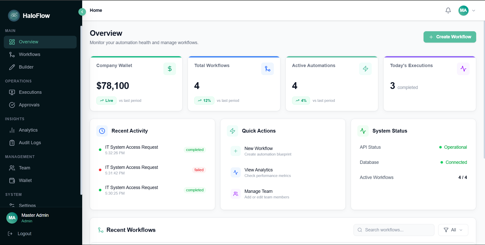
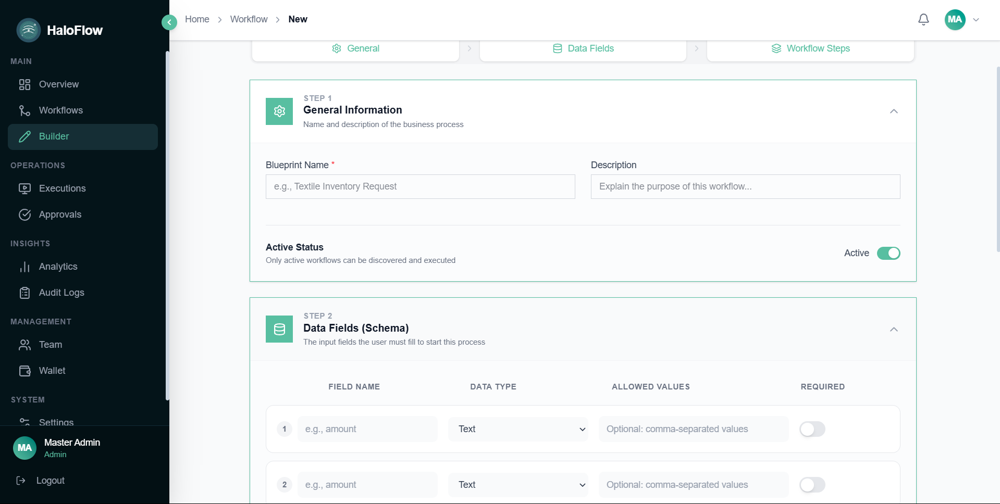
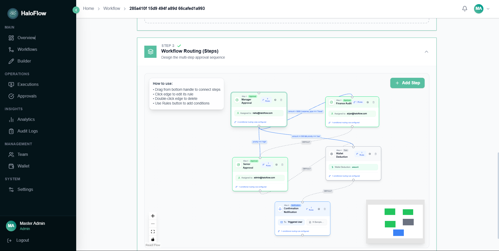
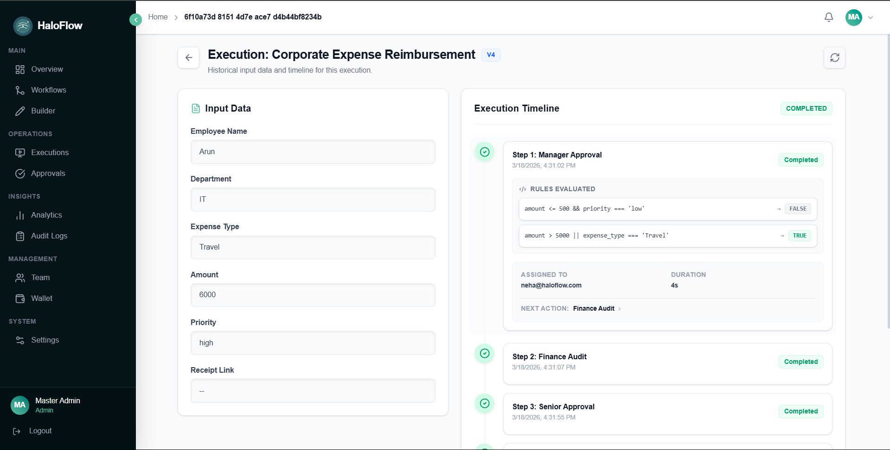
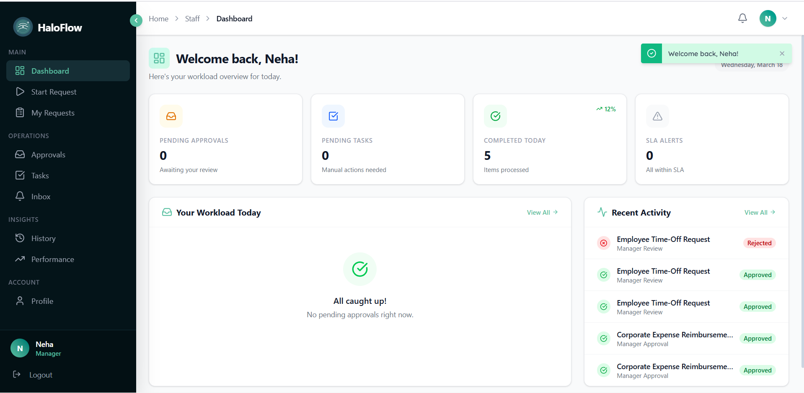
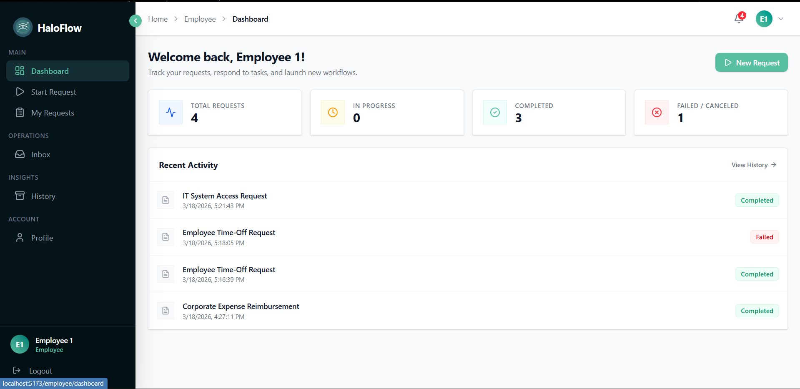
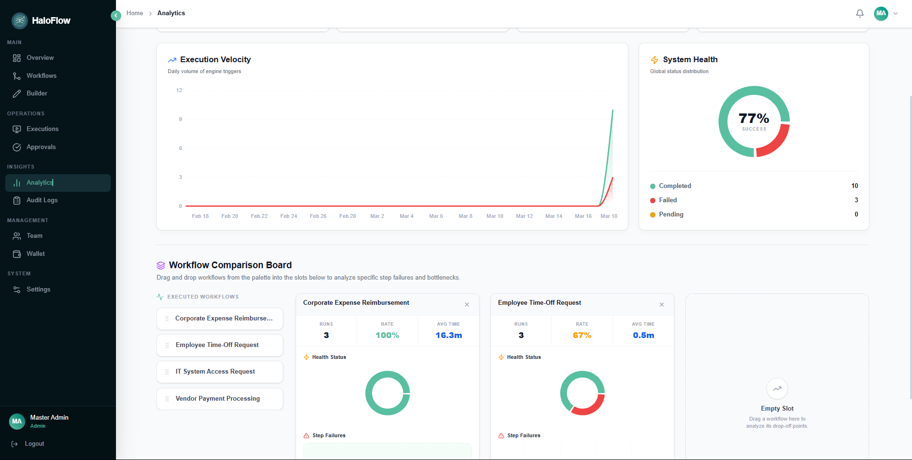
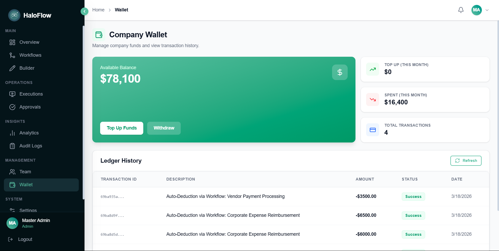

# 🎨 Frontend - React Client

> A role-based workflow automation dashboard enabling process design, execution, and monitoring.

The client application of HaloFlow serves as an intuitive portal enabling Administrative Process Design, Staff Approvals, and Employee Executions. It is built as a high-performance frontend utilizing Vite, React 19, and Tailwind CSS.

## 🚀 How to Run the Frontend
⚠️ **Requires backend API running at `http://localhost:5000`**

Ensure you are in the `/client` directory and your Backend is actively serving requests.

**1. Configure Environment**
Create a `.env` file in the `/client` root directory to hook into the API:
```env
VITE_API_URL=http://localhost:5000
```

**2. Install and Run**
```bash
npm install
npm run dev

# The application is available at http://localhost:5173
```

## ✨ Frontend Features
- **Visual Workflow Builder**: Interactive drag-and-drop interface mapping node connections dynamically.
- **Rule Editor with Drag-and-Drop**: Sortable lists managing complex execution logic priorities.
- **Real-time Execution Timeline**: Terminal-style views tracking live progression and rule evaluations.
- **Role-based Dashboards**: Custom portals segmented for Admin, Staff, and Employee users.
- **Analytics & Reports**: Visual charts and aggregations tracking system throughput and wallet metrics.

## 🔄 User Flow
1. **Admin creates workflow**: Defines the overarching process and required Input Schema.
2. **Admin defines steps and rules**: Maps out Tasks, Approvals, and Notifications using the Visual Builder and attaches logical routing Rules.
3. **Employee executes workflow**: Fills out the generated schema form to trigger a workflow instance.
4. **Staff receives approval request**: Staff users are notified and grant or reject pending step actions.
5. **Workflow completes and logs are stored**: The engine reaches an end node and permanently stores the execution trajectory for future audits.

## 🏗️ UI & Project Structure
The frontend architecture explicitly compartmentalizes UI presentation (`Components`) from Data Orchestration (`Pages` / `Store`).
- **`/src/pages`**: Organized using role-based routing.
  - `/admin/*`: Governance over RBAC, Workflow Blueprints, and aggregate analytics.
  - `/staff/*`: Dedicated panels for user Approvals.
  - `/employee/*`: Simplified portals strictly for initiating Executions and receiving feedback.
- **`/src/components`**: Standard component blocks ranging from atomic inputs to complex abstractions:
  - `VisualWorkflowBuilder.jsx`: Integrates `reactflow` dynamically converting server-sent linked lists into a visual interactive interface.
  - `RuleEditor.jsx`: Configures the hierarchy arrays using `@dnd-kit/core` dragging interactions.
- **`/src/utils` & State Management**: Global states utilize **Zustand** for efficient updates. Network utilities depend on central `axios.js` abstractions.

## 📑 Core Pages Overview
1. **Analytical Dashboard (`/`)**: A metric-forward overview rendering aggregation metrics via `Recharts` representing system health and historical throughput.
2. **Workflow List (`/workflows`)**: Central registry to search, filter, version check, and interact with baseline Workflow models.
3. **Builder Studio (`/builder/:id`)**: The interactive canvas area to lay down Nodes (`Tasks`, `Notifications`), manage configurations, and establish execution branches.
4. **Execution Prompt & Terminal (`/execute/:id`) & (`/executions/:id`)**:
   - Executes logic requiring mandatory schemas mapping precisely to variable validations defining user input.
   - Transitions users post-execution directly into a terminal tracking dynamic path traversal flags in real-time. 
5. **Team Access & Wallet Administration**: Interfaces to manage application RBAC assignments and configure specific user fund metrics.

## 🖼️ UI Preview


*Admin Dashboard with KPIs and system overview.*


*Visual Workflow Builder canvas mapping sequential logic nodes.*


*Detailed properties allowing administrators to wire routing schemas natively in-app.*


*Real-time Execution logs documenting traversal pathways and evaluation outcomes.*


*Role-defined Staff dashboard filtering live active action requests requiring review.*


*Employee portal governing accessible internal workflow triggers and history.*


*Recharts integration mapping workflow utilization patterns.*


*Internal ledger interface tracking global and departmental wallet expenditures.*
